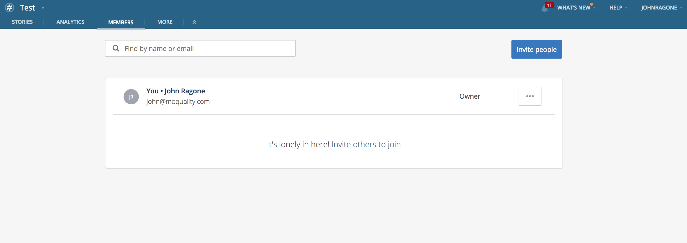
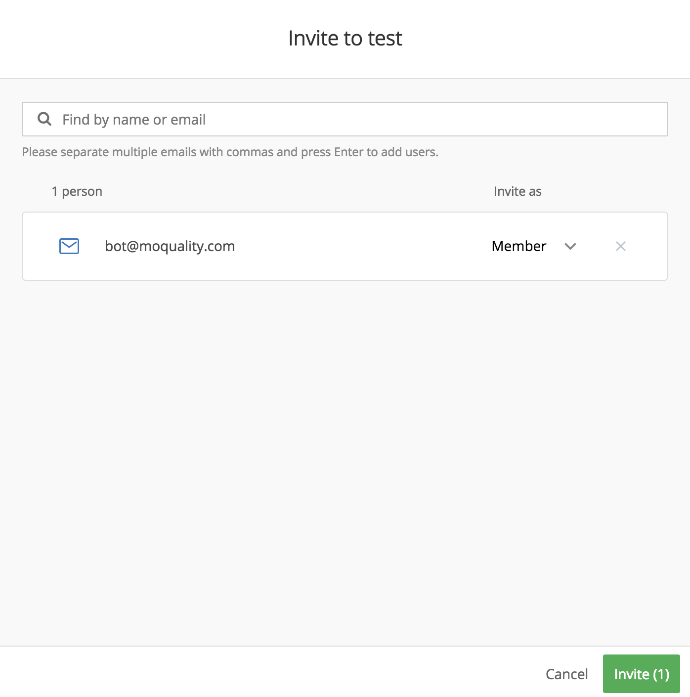
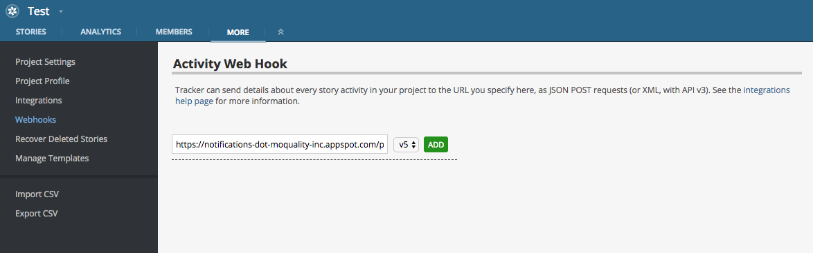

# Getting Started with PTBot

## Introduction

Pivotal Tracker is an agile project management tool that developers employ for maintaing project backlogs. Just as it is important to keep logs of new features and implementations, it is also essential to keep logs of the integrity of said features. MoQuality's Pivotal Tracker bot (PTBot) does this for you. When generating tests on MoQuality, you can simply add a link to a pivotal tracker story and PTBot will automatically post status updates in the comments of your story. To enable this integration, you need only to follow two simple steps.

## Prerequisites

* Pivotal Tracker account & project: In order to use PTBot, you will, of course, need to have created a [Pivotal Tracker account](https://www.pivotaltracker.com/signup/new) and a [project](https://www.pivotaltracker.com/help/articles/creating_a_project/).
* MoQuality account: PTBot will need to link your Pivotal Tracker project to your MoQuality account, which you can create [here](https://app.moquality.com/signup).
* MoQuality app: For the purpose of generating tests and receiving test status notifications, ensure that you have already uploaded the first version of your app through the [MoQuality website](https://app.moquality.com/).

## Installation

### Invite PTBot to Your Project

PTBot is a Pivotal Tracker user, named `MoQuality Bot`. In order for PTBot to comment on a story, it must be a member of your Pivotal Tracker project. To invite PTBot, visit the `MEMBERS` tab on your project,

press the `Invite People` button, and invite `bot@moquality.com` as a member of your project.

This will add PTBot to your project, enabling the bot to comment on stories.

### Add a Webhook to Your Project

Pivotal Tracker offers webhook support for projects. A [Pivotal Tracker project webhook](https://www.pivotaltracker.com/help/articles/activity_webhook/) is a location to which Pivotal tracker sends activity information when changes are made to a project. For instance, when a story's state is changed to `Delivered`, Pivotal Tracker will send JSON data, describing that change, to the project's webhooks. When PTBot's webhook is added to your project, PTBot can monitor a story's state to tell you when to upload a new version of your app to MoQuality. To add PTBot's webhook to your project, visit the `MORE` tab on your project, select the `Webhooks` page from the menu on the left, and add the following webhook URL to your project: `https://notifications-dot-moquality-inc.appspot.com/ptbot/events`

## Setup

To recieve testing updates in the comments of a story, enter your story's URL when you press the `Generate Tests` button on your MoQuality app's page. This will tell PTBot where to post status updates from those tests. You can also enter the story's URL on the test report's page. A story URL can be copied from Pivotal Tracker by expanding a story and clicking the chain symbol underneath a story's name.

## Troubleshooting

### Undocumented Error

If you encounter an error that is not documented, please open an issue on our [public GitHub repository](https://github.com/moquality/devcenter/issues). Alternatively, you can report your error to <hello@moquality.com>.