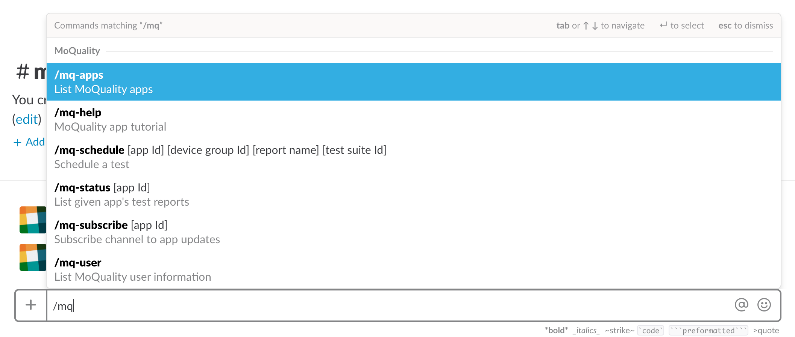

# Getting Started with Slackbot

## Introduction

MoQuality enables you to schedule tests when you deploy a new build of your app. However, these tests take time, and so does monitoring their success. Rather than watch and wait for your tests to complete, Slack users can install the MoQuality bot to their workspace. This bot, referred to as Slackbot, will send a notification with test results to your desired Slack channel when a chosen app's test has completed. In order to utilize MoQuality bot's services effectively, there are several steps to follow.

## Prerequisites

* Slack account & workspace: In order to use Slackbot, you will, of course, need to have created a [Slack account](https://slack.com/get-started), [workspace](https://slack.com/create), and [channel](https://get.slack.help/hc/en-us/articles/201402297-Create-a-channel). It is ideal to create a channel specifically for the use of Slackbot.
* MoQuality account: Slackbot will need to link your Slack account to your MoQuality account, which you can create [here](https://app.moquality.com/signup).
* MoQuality app: For the purpose of receiving an app's status updates from Slackbot, ensure that you have already uploaded the first version of your app through the [MoQuality website](https://app.moquality.com/).

## Installation

Install Slackbot from your [MoQuality account page](https://app.moquality.com/account) under the `Integrations` tab. Slack will prompt you to authorize the bot for a channel. There is one permission that the bot requires. Said permission is the ability to *Send messages as MoQuality*. This permission is necessary for Slackbot to post messages as a bot user.

## Setup

Once Slackbot is integrated with your workspace, your MoQuality and Slack accounts are linked. This means that you or anyone else in your workspace can invoke one of Slackbots many [Slash Commands](features/#slash commands). By typing `/mq` in your Slack workspace, you should see a list of the available Slash Commands.

The first Slash Command you may want to use is [`/mq-subscribe [app Id]`](features/#mq-subscribe). This command subscribes the authorized channel to test updates from the given MoQuality app. After subscribing the channel, Slackbot posts a public message as an attachment containing information about the subscription.

## Uninstallation

Slackbot can be uninstalled by navigating to the `Integrations` tab of your [MoQuality account page](https://app.moquality.com/account) and pressing the `X` on the top right of the Slack integration. This will direct you to Slackbot's configuration page, and at the bottom of said page is the `Remove app` button. By clicking that button, Slackbot will be uninstalled from your workspace and your MoQuality account will be delinked from your Slack account.

## Troubleshooting

If you encounter an error, please open an issue on our [public GitHub repository](https://github.com/moquality/devcenter/issues). Alternatively, you can report your error to <hello@moquality.com>.