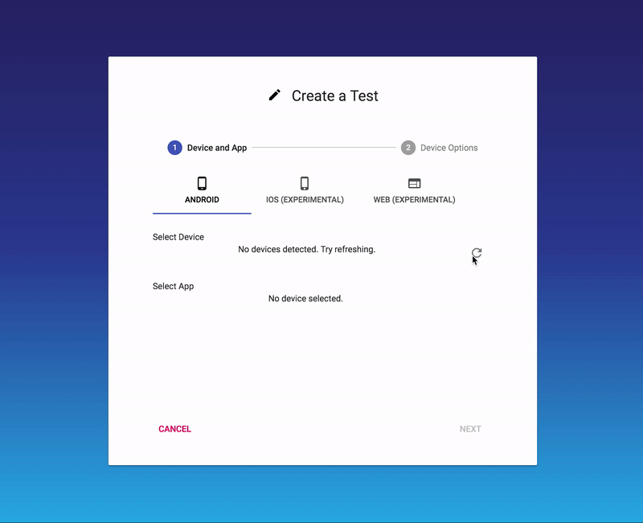

# Getting Started with the Recorder

The MoQuality test recorder provides functionality for recording test cases for mobile apps, as well as for both replaying test cases on a local device and editing them. In addition, it offers useful supplementary functionality, such as the ability to automatically download and install the app  on a new device.

For a full overview of the recorder's functionality, see [the Recorder Feature List](features).

## Downloading the Recorder

Download the recorder from [app.moquality.com/download](https://app.moquality.com/download).

## Setup the Device

Setup differs rather significantly between Android and iOS. Please consult the relevant page for the device you wish to record test cases with.

* [Recorder Setup for Android Devices](android)
* [Recorder Setup for iOS Devices](ios)

## Recording a Test Case

1. Choose a device and an app.

    

2. Choose device settings.
3. Install app (for the first time use).
4. Click "Record".
5. Perform actions in the app.
6. Click "Save".
7. Enter a name for the test.
8. Click "Save".

## Replaying a Test

1. Choose a device.
2. Choose the app that the test was recorded for.
3. Choose device settings.
4. Install app (if it is not previously installed).
5. Switch to the "Tests" tab.
6. Find the test that you would like to replay and expand it.
7. Click "Run".

## Editing a Test
After saving a test, a user may want to edit a test such as adding a time delay, or deleting a step. For more information see [Test editing](test-editing)

## Troubleshooting

### Infinite Loading Screen

####Get a screenshot

In some cases, the recorder may fail to start properly when connecting to a device. If this occurs, you will be presented with an error message, following which the loading screen will continue to load infinitely. This usually happens as a result of a desynchronization between the device and ADB, the Android Debug Bridge, resulting in ADB classifying the device as "offline". If this happens, try the following steps:

1. Close the recorder.
2. Unplug the device.
3. Disable USB debugging in the devices settings ([Click here to know how](android)). 
4. Re-enable USB debugging.
5. Plug the device back in.
6. Start the recorder again.

If the problem persists, please contact MoQuality for further support.

## Appendix: Differences between Android and iOS

For the most part, Android and iOS devices behave similarly in the recorder, but there are a few differences. Some of these are obvious, as they pertain to unique features that one device type or the other has, such as the back button, which doesn't exist on iOS.

A larger, less obvious difference is that of touch control. On Android, the mouse emulates a touch input, providing a clean 1-to-1 interaction between the recorder and the app. Unfortunately, due to limitations in iOS automation, the recorder is unable to do this 1-to-1 interaction with iOS devices.

When clicking on the screen while using an iOS device, a circle will appear where the mouse button was pressed. If the mouse is dragged past a threshold distance away from that starting point, a second circle will appear under the mouse with a line connecting the two. If this appears, releasing the mouse will perform a drag from the first circle to the second; if it has not appeared, a click will be performed at the location of the circle instead.
