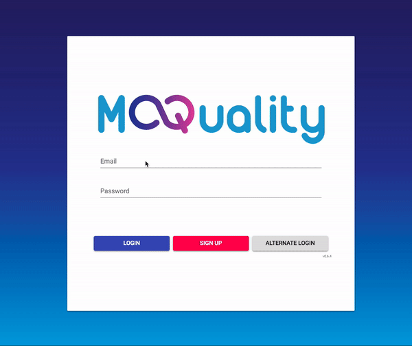
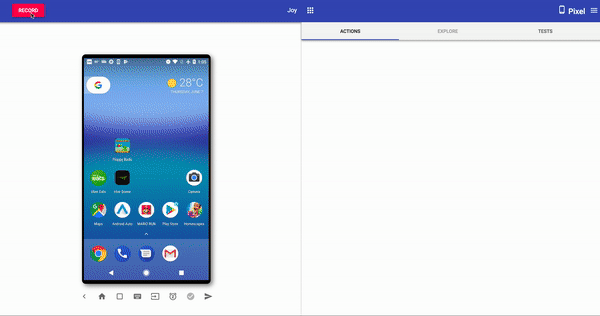
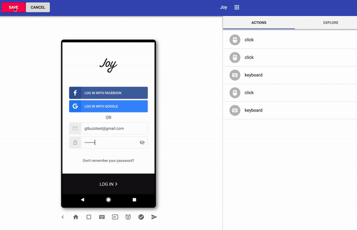
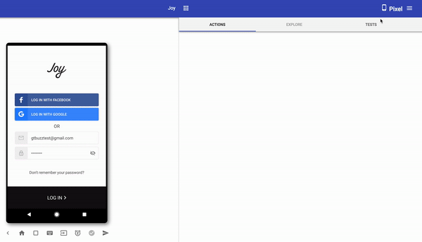

# Getting Started with Barista

Barista can be used to record, replay and edit tests using a local mobile device. It automatically downloads and installs the app on a new mobile device.

For a full functionality overview, see [Barista's Feature List](features).

## Installing Barista

Install Barista with [brew](https://brew.sh/) or [download here](https://app.moquality.com):
```
brew cask install moquality/brew/barista
```

## Setup the Device
Android and iOS devices are setup differently, as follows:

* [Setup an Android Device](android)
* [Setup an iOS Device](ios)

## Launch Barista

1. Launch Barista with your connected device and log in with either your *API key* or *username/password*. 

    

## Creating a Test Case

1. Select your device and app from the drop down, as well as your screen size and keyboard preference. We recommend setting it to no-keyboard, tests are more reliable without flaky keyboard. The recorder itself has a text input feature which will allow you to input text into text boxes.

    

2. Install app (for the first time use).
3. Click "Record".
4. Demonstrate the user flow for the test case in the app.Interact with the screen projection you see in front of you. You **MUST use the bottom interface buttons** for actions instead of the hardware buttons on your device. Hardware buttons include back button, home screen button and show apps button. Similarly, if your device has software buttons, do not click them. We assume that software buttoms will never be a part of a test case and discard them.

    

5. Click "Save".
6. Enter a name for the test.
7. Click "Save".

    

## Replaying a Test

1. Choose a device.
2. Choose the app that the test was recorded for.
3. Choose device settings.
4. Install app (if it is not previously installed).
5. Switch to the "Tests" tab.
6. Find the test that you would like to replay and expand it.
7. Click "Run". 
8. If you are unable to run the test, you can edit or re-record the test.

    

## Editing a Test
After saving a test recording, you can make changes to a test such as adding a time delay, deleting a step, edit actions, add assertions, force select UI elements and much more. For more information see [Test editing](test-editing)

## Troubleshooting

### Infinite Loading Screen

In some cases, the recorder may fail to start properly when connecting to a device. If this occurs, you will be presented with an error message, following which the loading screen will continue to load infinitely. This usually happens as a result of a desynchronization between the device and ADB (Android Debug Bridge), resulting in ADB classifying the device as "offline". If this happens, try the following steps:

1. Close the recorder.
2. Unplug the device.
3. Disable USB debugging in the devices settings ([Click here to know how](android)). 
4. Re-enable USB debugging.
5. Plug the device back in.
6. Start the recorder again.

If the problem persists, please contact MoQuality for further support.

### Differences between Android and iOS test recording

Android and iOS devices behave similarly in the recorder, but there are a few differences in the touch control.

On Android, the mouse pointer emulates a touch input, providing a clean 1-to-1 interaction between the recorder and the app. Unfortunately, due to limitations in iOS automation, the recorder is unable to do this 1-to-1 interaction with iOS devices.

When clicking on the screen while using an iOS device, a circle will appear where the mouse button was pressed. If the mouse is dragged past a threshold distance away from that starting point, a second circle will appear under the mouse with a line connecting the two. If this appears, releasing the mouse will perform a drag from the first circle to the second; if it does not appear, then a click action will be performed at the location of the first circle instead.

### Why does my phone not connect?

Double-check that USB debugging is on and that you have clicked 'Allow' on the on-screen popup. You may have to unplug and replug the device in some cases.

### Why does it say I need to re-record in 'Stable Mode'?

For some apps and tests, the regular mode may be unable to capture all the necessary details to successfully run the test. You can toggle 'Stable Mode' inside the recording by going into 'Settings' and toggling the option.