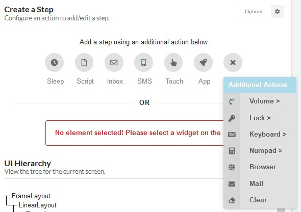
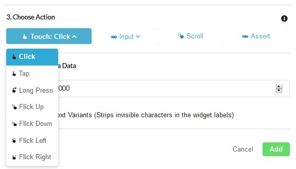

# Choose Action

Actions define the operations that your test script will perform either on the component you selected on using built in features of the phone. You can select actions either before or after you select the component.

The image below shows the actions that are available before you have selected a component. These actions  do not apply to a specific feature of your app. They provide ways to control the phone's built in features. See the **Phone Actions** section for definitions of each of these actions:

Once you have selected a component of your app, select an action that your test script will perform on the component. The image below shows all of the actions that are available when you have an app component selected. These actions are defined in detail in the **App Actions** section:

The available actions are based on the Andriod SDK and the Appium specifications.

## Phone and Script Actions

The following list defines the actions you can select to control the phone or modify your test script:

* **Sleep** - Pauses the test script for a configurable number of seconds.
* **Script** - Enables direct editing of the Appium code for this step.
* **Inbox** - Simulates receiving an email in the phone's inbox. Define the contents of the email directly in the script.
* **SMS** - Simulates receiving an SMS message on the phone. Define the contents of the message directly in the script.
* **Touch** - Defines a Tap or Swipe action on the phone screen. Select a UI component of the app after choosing Tap or Swipe by clicking on the phone screen or the UI Hierarchy.
* **App** - Executes operating system level actions that impact the current app or launch other apps. Click on the App button in the Test Authoring Tool to select on of the actions below:
  * **Reset App** - Closes and reopens the current app.
  * **Launch App** - Opens a different app.
  * **Close App** - Closes the currently open app.
  * **Background App** - Runs the current app in the background.
  * **Orient Natural** - Sets the phones rotation to vertical.
  * **Orient Landscape** - Sets the phones rotation to landscape.
  * **GeoLocation** - Sets the phone's location to a specified GPS coordinate and makes the location available to the app. Define the location in the fields that display after you select the GPS action.
* **Volume** - Increases or decreases the phones volume.
* **Lock** - Locks or unlocks the phone.
* **Keyboard** - Opens the phone's on screen keyboard.
* **Numpad** - Opens the phone's number pad.
* **Browser** - Opens the phone's default browser.
* **Mail** - Open's the phone's default email app.
* **Clear** - Clears a text entry or number entry field.

## Choose Action

After selecting a component, the Choose Action area displays. You can select an action to perform on the component and set a timeout for the test script.

#### Actions

The following list defines the actions that you can perform on a component of your app:

* **Touch** - Touch or swipe the screen. The following touch action types are available:
  * **Click** - Touch the screen at specified coordinates.
  * **Tap** - Touch a UI element.
  * **Long Press** - Touch and hold on a UI element.
  * **Flick Up** - Swipe up quickly on a UI element.
  * **Flick Down** - Swipe down quickly on a UI element.
  * **Flick Left** - Swipe left quickly on a UI element.
  * **Flick Right** - Swipe right quickly on a UI element.
* **Input** - Enter text in a text input field. Define the text in the pop up that displays after you select input.
* **Scroll** - Scroll a list up or down.
* **Assert** - Define a state or value of the UI element to check.

Actions must be compatible with the app component. For example, you cannot add a text entry action to a button.

#### Timeout

Timeouts define an amount of time in milliseconds that the test script will wait for a result from the step before stopping. To set a time out enter the value in the Timeout field in the **Optional.** section of the Create a Step panel.

