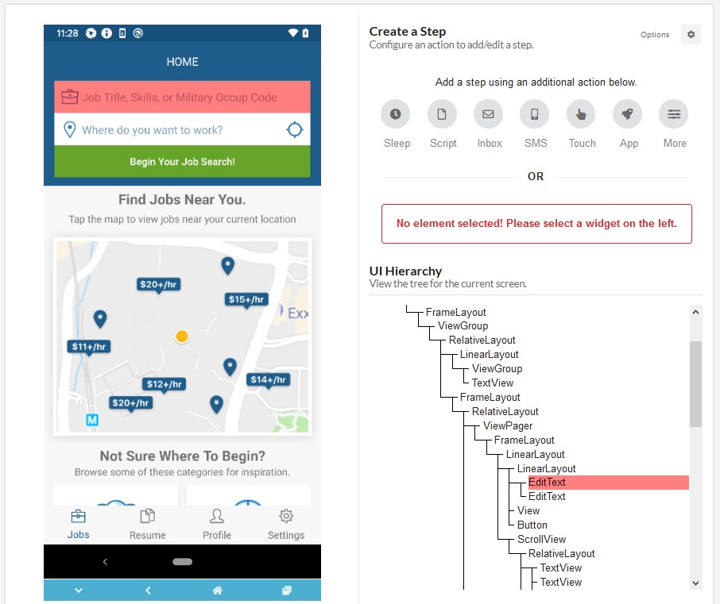
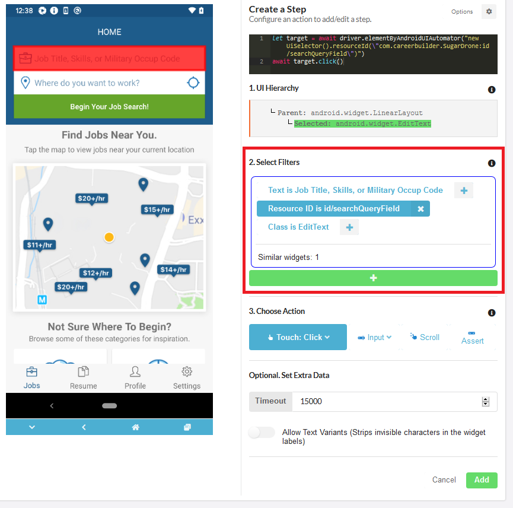
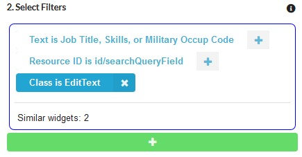
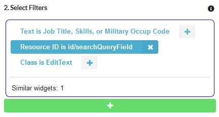

# Filters and UI Hierarchy

Use the virtualized phone screen, the UI Hierarchy, and Filters to define a component of your app target with the step. Each method is useful for refining the current selection. The image below shows the virtualized phone screen on the left, and the UI Hierarchy on the right. Moving your mouse around on the phone screen highlights the corresponding element in the UI Hierarchy, as shown by the red on the image below:

By identifying the element's position in the UI Hierarchy, you can make sure that you are selecting the correct element. For example, it is possible to click on a field label or icon instead of selecting the text entry component. If it is difficult to select the element directly on the screen, you can also click on the element in the UI Hierarchy tree.

Once you select an element, the Select Filters section appears in the Create a Step panel of the Test Authoring Tool. The image below highlights the Select Filters section. See the **Filters** section for details.

## Filters

Filters refine your component selection and let you define how your test script will identify the component that it will operate on. For example, the image below shows filters for a text entry field:

Using the "Class is EditText" filter refers to two different components. To identify the specific EditText element, you can choose to use the Resource ID or the label text for the field. Filtering based on Class may not be necessary. The image below shows that selecting the unique Resource ID is enough to identify the correct app component:

The filter that you choose depends on your app and test design. The Test Authoring Tool supports the following filters:

* **Text** - The label text set on the field.
* **Resource ID** - The unique Resource ID that you used in your code to identify the component.
* **Class** - The object, Android, or iOS class that the component is based on.

If you set more than one filter the Test Authoring Tool applies the filters using an OR operation.

